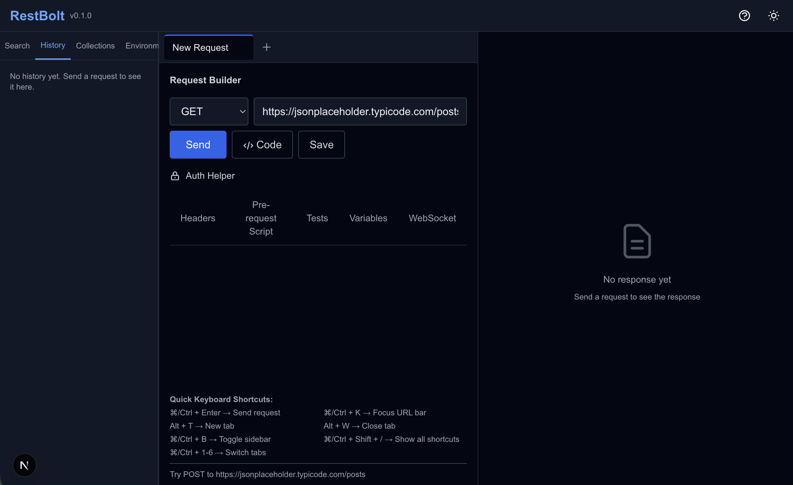
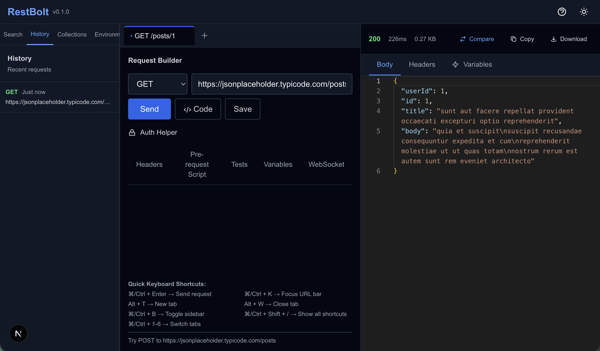
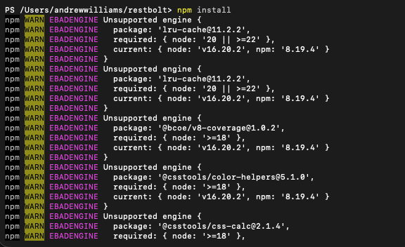

# Getting Started with RestBolt

## Installation

### Prerequisites
- Node.js 18 or higher
- npm or yarn

### Steps

```bash
# Clone the repository
git clone https://github.com/Dancode-188/restbolt.git
cd restbolt

# Install dependencies
npm install

# Start the development server
npm run dev
```

Then open http://localhost:3000 in your browser.

## Your First Request

Let's send your first API request!



### Step 1: Enter a URL
Click the URL bar and enter:
`https://jsonplaceholder.typicode.com/posts/1`

### Step 2: Click Send
Click the "Send" button or press Cmd/Ctrl+Enter



### Step 3: View the Response
The response appears on the right side, beautifully formatted!

🎉 Congratulations! You've sent your first request with RestBolt!

## Common Pitfalls and Solutions

### Node.js version requirements
Node.js 18+ is required to run RestBolt (https://nodejs.org/en/download). If you run RestBolt with an older version, you might encounter the following error:



When running `npm run dev`, you will receive this message if the version is older than required:

```
You are using Node.js 16.20.2. For Next.js, Node.js version "^18.18.0 || ^19.8.0
| >= 20.0.0" is required.
```

To check your Node.js version, use the following command in Terminal:
`node -v`

### Ensure `npm install` completes before running `npm run dev`
Before running `npm run dev`, you should receive the following output. This indicates `npm install` has been completed.


### RestBolt is a local-first (IndexedDB) application
There is no backend server to configure when using RestBolt. Benefits include:

* Immediate UX: Provides low-latency and immediate interactions.
* Offline capability: Features remain available without an active network.

## What's Next?
- Learn about Collections
- Try the Chain Builder
- Set up Environments. 
